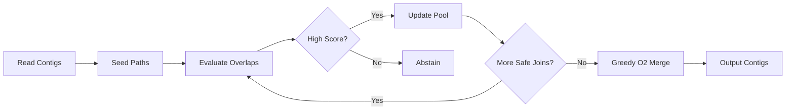
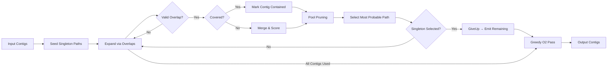

<br><br>
<h1 style='color:#20241f;opacity:85%;text-shadow:2px 2px 14px white'><b>Referenceless Contig Stitcher</b></h1>
<h3 style='color:white;opacity:80%;text-shadow:1px 1px 0px black,-1px 1px 0px black,1px -1px 0px black,-1px -1px 0px black'>Safe overlap stitching to rescue fragmented denovo assemblies</h3>
<div class="absolute bottom-5 left-3" style='opacity:85%;text-shadow:1px 1px 0px black,-1px -1px 0px black'>
  <b>23 Sep 2025 · Internal Tech Update</b>
</div>
<!-- Notes: Internal module; goal = increase usable-yield in denovo mode. -->

---

## Title & One‑Liner

Referenceless Contig Stitcher: increase usable assemblies in denovo mode with zero workflow changes.

Sub: Reference-free overlap stitching that abstains unless confident.

<!-- Keep concise; pipeline-internal framing. -->

---

## Current State (The Pain)

- Denovo samples fragment into multiple contigs.
- Fragmented cases lacking a single near-full-length contig are often discarded or deferred.
- Lost downstream analyses; re-runs delay insight.
- No reference (by design) here → reference-aware stitchers can’t help yet.


<!-- Focus on usable-yield loss; avoid manual merge claims. -->

---

## What It Does (Input → Process → Output)

Input (denovo mode): assembler FASTA (IVA, etc.)

Process:
 - Reference-free overlap scoring
 - High-confidence stitching only (≈99 effective matches threshold)
 - Event logs (DeterminedOverlap, CombinedContigs, Covered)
 - Abstains on ambiguity or low score

Output:
- Stitched FASTA OR original contigs (unchanged) if no safe join

<!-- Safety via abstention, not aggressive merging. -->

---

## Where It Fits (Integration in MiCall)

- Invoked inside MiCall `sample.py` (via Kive)
- No user action; not exposed as separate tool
- Reference-aware stitchers still run later (complementary)
- Non-denovo / clinical flows unaffected


---

## Why It’s Safe (Guardrails)

- Conservative threshold (~99 matches) for merges
- Fully covered fragments discarded (prevents duplication)
- Alternative path pool bounded (SortedRing ≤ 999)
- Detailed event logging for each decision
- Abstain strategy: uncertain overlaps → keep originals


---

## How It Works (Condensed – Referenceless)

Guiding principles:
1. Scale-Dependent Credibility (longer, high‑match overlaps dominate)
2. Length Prioritization (seed with longest contigs first)
3. Ambiguity Omission (skip uncertain joins rather than risk chimera)

Operational steps:
1. Seed: Create singleton paths (longest-first ordering)
2. Path Expansion: For each path, attempt overlaps with remaining contigs (cached alignment & cutoff logic)
3. Scoring: Transform overlap quality → amplified score; coverage yields SCORE_EPSILON
4. Coverage Handling: If candidate is fully covered (SCORE_EPSILON), mark as contained (do NOT duplicate)
5. Pool Pruning: Keep only top-scoring alternative paths (capacity derived from n_candidates)
6. Selection: Emit most probable path; remove all its constituent (and covered) contigs
7. Termination (GiveUp): If selected path is a singleton (no safe joins), output all remaining unchanged
8. O2 Pass: Lightweight greedy pairwise merge sweep for any trivial remaining overlaps

Note: No gap-splitting rule in referenceless mode (that belonged to reference-based logic). Removed here to avoid confusion.

---

## Architecture (Data Structures & Flow)

Core structures:
- Pool: bounded SortedRing of candidate contig paths (caps alternative exploration)
- ContigsPath: sequence of contigs + cumulative score
- Overlap: local alignment stats (matches, length, offsets)
- Events: structured log objects (DetermininedOverlap, CombinedContigs, Covered, GiveUp)

Processing flow:


Design choices:
- Bounded pool prevents combinatorial path explosion
- Sentinels (SCORE_EPSILON) simplify coverage detection & safe discard
- Final O2 greedy pass opportunistically merges remaining trivial joins

<!-- Keep slide concise; deeper math on next slides. -->

---

## Constants & Thresholds (Why These Numbers)

Core constants:
- MIN_MATCHES = 99  → require ~99 effective matches to trust an overlap merge.
- MAX_ALTERNATIVES = 999  → upper bound on explored path variants.
- SCORE_EPSILON = 1  → sentinel score signifying coverage/no additional information.

Overlap scoring sketch:
```
raw = overlap_matches / overlap_length
scaled = (raw * 999)^2
```
Reasons:
- Amplify separation between high-quality overlaps (square magnifies differences near 1.0).
- Keep any genuine overlap score far from SCORE_EPSILON sentinel.

Adaptive alternatives cap:
```
cap = clamp( 999 / max(1, n_candidates - 2), 1, 999 )
```
Implication: more candidate contigs → tighter cap → earlier pruning.

Coverage detection:
- Additional_score == SCORE_EPSILON ⇒ contig fully covered; safe to discard.

<!-- Detailed pool mechanics next. -->

---

## Path Pruning & Pool Mechanics

Goals: retain only promising assembly hypotheses; prevent combinatorial blow-up.

Pool behavior:
- Fixed capacity (cap computed from n_candidates) using a SortedRing.
- Each new candidate path scored; if pool full & new score > worst → replace & raise minimum.
- Duplicate / dominated paths (same contig set, lower score) rejected quickly.

Effect:
- Early elimination of low-scoring partial merges.
- Runtime roughly proportional to (cap * avg overlaps evaluated).
- Encourages exploitation of strongest overlaps first (greedy tendency with safety net of limited exploration).

Give-up condition:
- When best path remains a singleton and no overlaps exceed threshold → abort further stitching (avoid futile search).

Why not exhaustive search?
- Exponential explosion with branching overlaps.
- Diminishing returns: lower-score alternatives rarely surpass high-quality early merges.

<!-- Edge cases & coverage logic next. -->

---

## Coverage & Edge Cases

Full coverage discard:
```
Contig A: ACGT...TTGA
Contig B:   CGT...TTG   (entirely aligned within A)
Score(additional) = SCORE_EPSILON ⇒ B removed
```

Slight insertion tolerated:
```
A: ACGTGG---TCA
B: ACGTGGACTTCA   (ACT insertion)
High match ratio remains >= MIN_MATCHES region ⇒ merged (overlap consensus).
```

Note: No internal rule to split large gaps in referenceless mode (that behavior belongs to reference-guided logic). We simply abstain if overlap evidence is insufficient.

Give-up scenario:
- Only singleton high-score path remains; all prospective overlaps below threshold → stop (avoid overfitting noise).

Failure safety:
- Worst case: no merges pass confidence → original FASTA returned unchanged.

<!-- Limitations & risks next. -->

---

## Limitations & Risks

Conservative by design:
- May under-merge in regions with real variation (divergence lowers match count below 99).
- Repeats / paralogs: ambiguity omission skips plausible merges (prefer false negatives over chimeras).

Parameter sensitivity:
- Fixed MIN_MATCHES not length-normalized; very short contigs (<150 bp) rarely merge → acceptable trade (low information anyway).
- MAX_ALTERNATIVES heuristic may still prune a rare but correct late path (observed low probability).

Biases:
- Length prioritization favors longer consensus paths; minority low-frequency variants may be masked (separate variant analysis later handles diversity).

Operational risks:
- Mis-set constant could either flood merges (chimeras) or stall benefit (no improvement). Mitigated by logging + metrics review.

Mitigations:
- Event log audit, validation dataset diff, future adaptive thresholds (Appendix E).

<!-- Back to outcomes / metrics next. -->

---

## Outcomes (Metrics to Collect)

User experience: unchanged (transparent)

Validation metrics (denovo set):
- Usable-yield (% single/target contig samples) ↑
- Contigs per sample (median / p95) ↓
- N50 & total assembled length ↑ or stable
- Event log ratios (merges / abstentions) sanity
- Runtime overhead (target < Y%)

---

## Validation & Rollout Plan

Phase 0 (now): finalize metric definitions & golden dataset
Phase 1 (wks 1–2): run on validation denovo set, capture metrics
Phase 2 (wks 3–4): compare before/after, review logs, sanity checks
Phase 3 (wks 5–6): include in MiCall release (denovo only) + release notes

Success (draft):
- ≥ X% relative increase usable-yield
- No increase in suspected chimeras
- Runtime overhead < Y%

---

## FAQ (Selected)

Q: Affect non-denovo?  A: No
Q: Replace existing stitchers?  A: Complements later reference-aware step
Q: Bad joins risk?  A: Conservative scoring + abstain path
Q: Performance?  A: Vectorized scoring; bounded alternatives
Q: Logging?  A: Detailed event log for reproducibility

---

## Decision

Approve inclusion in next MiCall release (denovo mode only)?

Success = higher usable-yield, stable quality, minimal runtime cost.
Fallback = disable flag; no external deps added.

---
dragPos:
  landscapes: 23,107,931,234
---

## Appendix A – Rule Flow (Conceptual)

<v-drag pos="landscapes">



</v-drag>

---

## Appendix B – Core Stitch Entry (Excerpt)

```python
from micall.utils.referenceless_contig_stitcher import (
  referenceless_contig_stitcher, read_contigs, write_contigs
)

def referenceless_contig_stitcher_with_ctx(input_fasta, output_fasta):
  contigs = tuple(read_contigs(input_fasta))
  log(events.Loaded(len(contigs)))
  if output_fasta is not None:
    contigs = tuple(stitch_consensus(contigs))  # overlap consensus + O2 pass
    log(events.Outputting(len(contigs)))
    write_contigs(output_fasta, contigs)
  return len(contigs)
```

Notes:
- `stitch_consensus` = overlap stitching + greedy O2 merge.
- Logging emits structured events (see next slide) for reproducibility.

---

## Appendix C – Sample Log Events

```text
Loaded 5 contigs.
Initializing initial seeds...
Starting with 5 initial seeds.
Constructed a path of length 4120.
Calculated cutoff for an overlap of size 132 between contigs c1 and c3 to be (54, 78).
Overlap between contigs c1 and c3 has aligned size 132, 129 matches, and the score of 0.977.
Found a significant overlap of size 132 between contigs c1 and c3, resulting in contig c1_c3.
Contig c1_c3 covers contig c2 completely.
Initial overlap stitching produced 2 contigs.
Giving up on attempts to stitch more overlaps since most probable is a singleton.
Outputting 2 contigs.
```

---

## Appendix D – Metrics Template (Fill Later)

| Metric | Baseline | After | Target | Status |
|--------|----------|-------|--------|--------|
| Usable-yield (% single contig) |  |  | +X% rel | Pending |
| Median contigs/sample |  |  | ↓ | Pending |
| N50 (bp) |  |  | ≥ | Pending |
| Runtime overhead (%) |  |  | < Y | Pending |
| Suspicious chimeras (controls) |  |  | = | Pending |
| Merge abstention rate |  |  | Reasonable band | Pending |

Definition notes:
- Usable-yield = % samples with 1 (or target threshold) contig after stitcher.
- Abstention rate outside bounds triggers review of MIN_MATCHES threshold.

---

## Appendix E – Future Enhancements (Optional)

- Adaptive thresholding (dynamic based on length / entropy)
- Parallel scoring across contigs (multiprocessing pool)
- Event log to JSON for automated QA dashboards
- Validation harness auto-report (CI artifact)

---
layout: cover
background: https://cover.sli.dev
zoom: 2.0
hideInToc: true
---

# Thank you

<!-- End of deck -->
