 
<h1 style='color:white;opacity:90%;text-shadow:0px 0px 24px white'><b>MiSeq Workflow</b></h1>
<h3 style='color:white;opacity:80%;text-shadow:1px 1px 0px black,-1px 1px 0px black,1px -1px 0px black,-1px -1px 0px black'>Challenges and solutions in the modern pipeline</h3>

  <b>11 Dec 2025 · Lab Update</b>

<!--
Hello everyone.

In this talk I want to walk through the MiSeq-based workflow that takes us from a requisition to either a tropism/resistance report or an intactness analysis.

I am not going to give a step-by-step SOP or a MiSeq troubleshooting guide. Instead, I want to focus on why the pipeline is shaped the way it is, and why we chose the particular intermediate states that we did.

Think of this as a map of the territory. After this talk, my goal is that when you hear "MiSeq run" or "consensus" or "intactness", you have a clear sense of where that sits in the bigger picture and why we bother doing it in the first place.
-->

---

## Motivation

Provide understanding of **how** the MiSeq pipeline works and **why** it is built the way it is.

- Every report we sign off on passes through many invisible steps.
- Each step encodes assumptions and constraints that affect what the result means.
- Understanding the key “states” of the pipeline helps us trust the output, debug problems, and argue for or against changes.

<!--
The starting question for this talk is very simple: why think about the MiSeq workflow at all?

Every resistance report or intactness analysis that we produce has travelled through a long chain of invisible steps. If we only ever see one piece of that chain, it is hard to judge how robust the final answer really is.

Each stage of the pipeline encodes assumptions and constraints. For example, what kind of sample we accept, what region of the genome we target, what we do when coverage is low, all of that quietly shapes the interpretation.
-->

---
dragPos:
  main: 120,0,758,568
---

<v-drag pos="main">
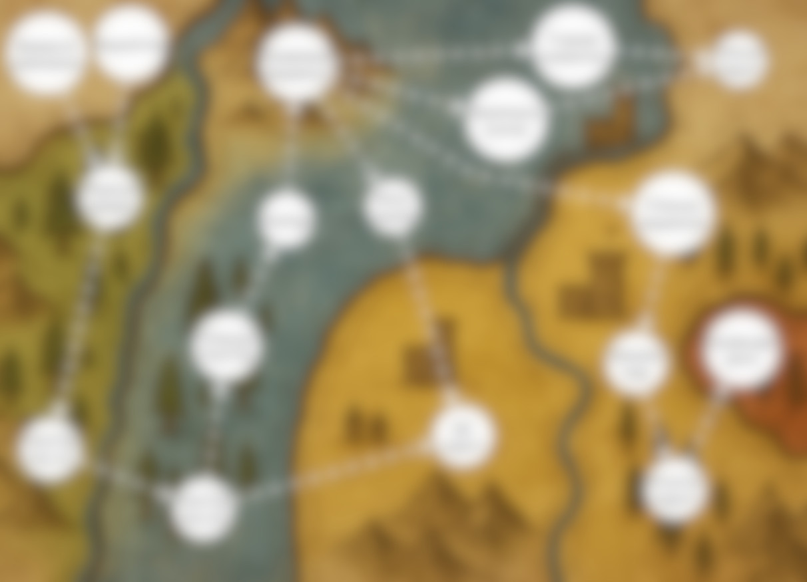
</v-drag>

<!--
On this slide I have a map of the whole workflow.
Currently everything is blurred out but we can see some white blobs and lines connecting them.
They represent progress through the pipeline.
-->

---
dragPos:
  main: 120,0,758,568
---

<v-drag pos="main">
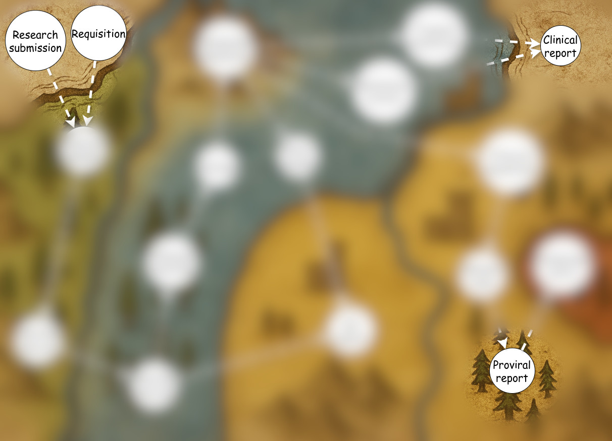
</v-drag>

<!--
If we compress all the complexity down to just a couple of sentences, the pipeline is trying to do two main things.

First, for V3 tropism testing and resistance testing, we start from a requisition and we owe the clinician a report.

Second, for research work, we start from a research submission and we owe our collaborators intactness analyses that they can trust in their projects.
-->

---
dragPos:
  main: 120,0,758,568
  text: 53,252,603,326
---

<v-drag pos="main">

</v-drag>

<v-drag pos="text">

Two main paths:

- From a **V3/HCV requisition** into a **tropism or resistance report**.
- From a **research submission** into a **consensus sequence** (optionally intactness analysis).

And do this in a way that:

- Keeps the **history** of each sample and run reconstructable.
- Makes it easy of use and maintain.

</v-drag>

<!--
Around those two transformations we have two design principles. The first is history: we want to be able to reconstruct what happened to a sample or a run months or years later. That means we care about preserving inputs, intermediate artefacts, and outputs, rather than just the final PDF.

The second is continuous improvement.
We know that methods, software, and standards change.
We do not want a pipeline that collapses every time we touch it.
So we aim for a structure where we can add QC, replace tools, or change thresholds, without losing track of what we did before.
-->

---
dragPos:
  v3req: 350,8,626,594
  points: 13,105,344,404
---

## Requisition

<v-drag pos="points">

### What it carries conceptually

- The question we are answering.
- The type of sample that will be sent.
- Type of report that the MiSeq workflow should produce.

 

- Doesn't always look like that ->

</v-drag>

<v-drag pos="v3req">

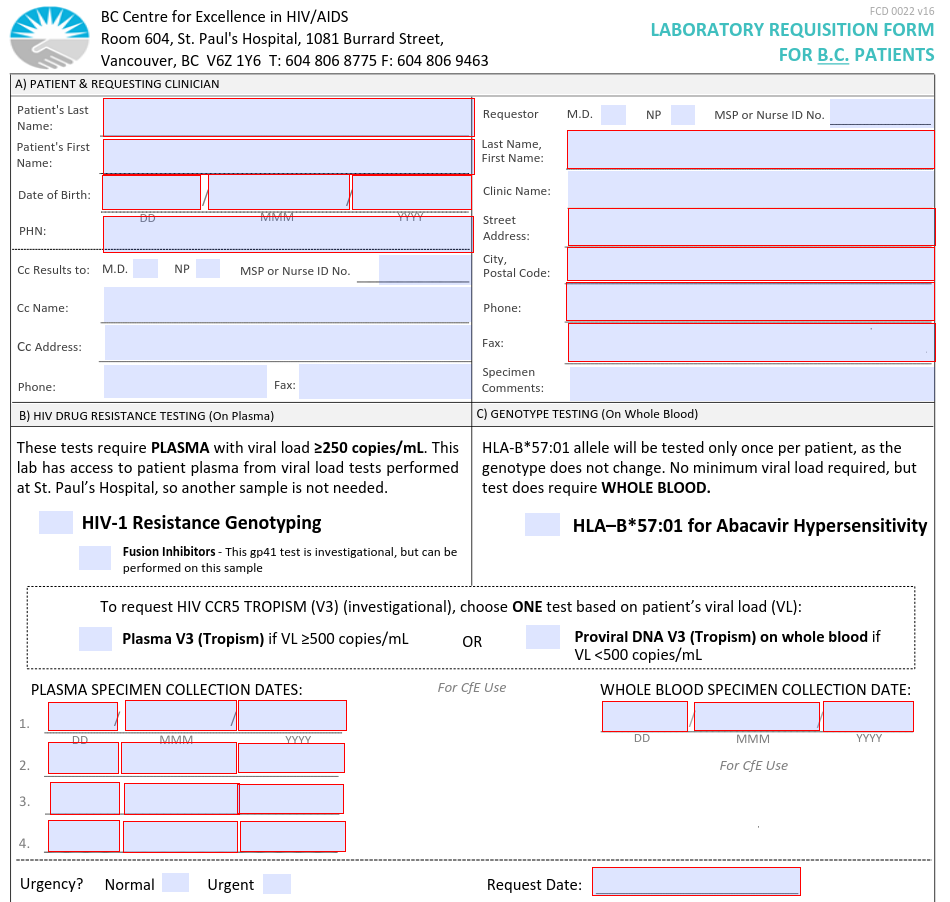

</v-drag>

<!--
The first state in the workflow is the requisition.

We start here because the requisition is where the "why" of the whole process is written down. Someone is asking us to do something specific for a person, and the requisition is the formal record of that request.

Conceptually, the requisition ties three things together. It ties a person or a coded participant ID, it ties the kind of sample that will arrive in the lab, and it ties the type of answer we promise to return, like a tropism report or a resistance interpretation.

The form on the right is our standard V3 requisition form.
But we accept requisitions that look differently too.
For example, LifeLabs has their own format.
It's the job of data techs to interpret custom requisitions and enter them into QAI.

-->

---
dragPos:
  hepcresist: 507,110,465,442
  v3: 16,138,484,407
---

## Final reports

<!--
Both V3 tropism and resistance testing follow the same pathway through the MiSeq workflow.
They use requisitions, produce similar formatted reports, and are both ordered by clinicians but not clinically approved.
-->

<v-drag pos="v3">

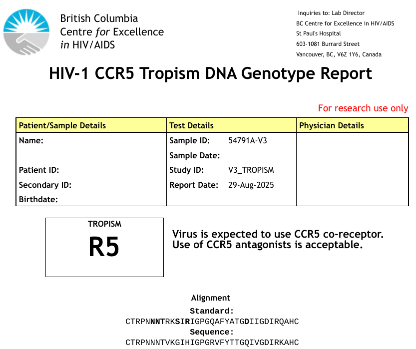

</v-drag>

<v-drag pos="hepcresist">

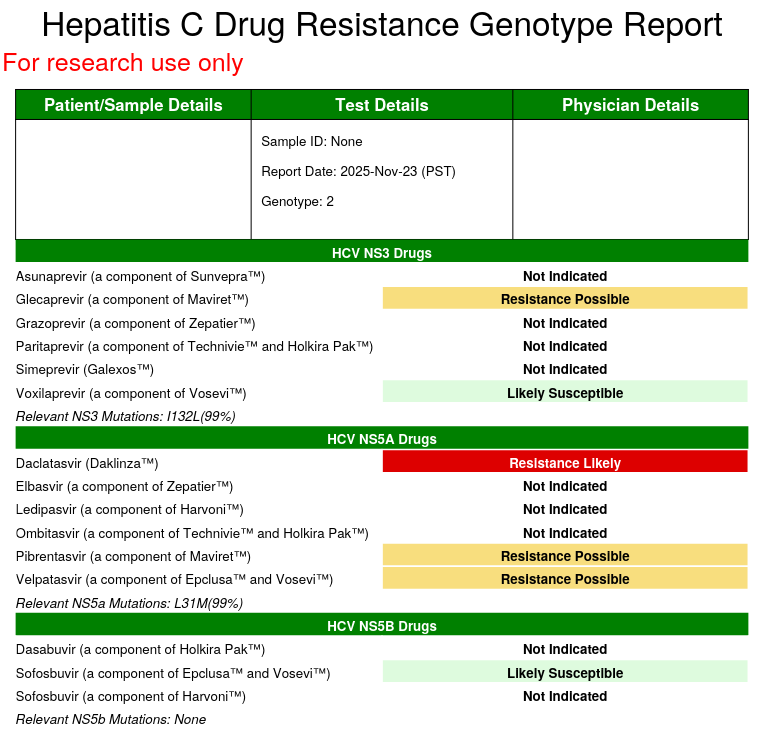

</v-drag>

<!--
These are examples of the final reports we produce. On the left is a V3 tropism report, on the right is a resistance report. 
-->

---
dragPos:
  main: 120,0,758,568
---

<v-drag pos="main">

</v-drag>

<!--
Zooming out again.
To get these reports we first receive a user request.
-->

---
dragPos:
  main: 120,0,758,568
  text: 134,493,474,44
---

<v-drag pos="main">
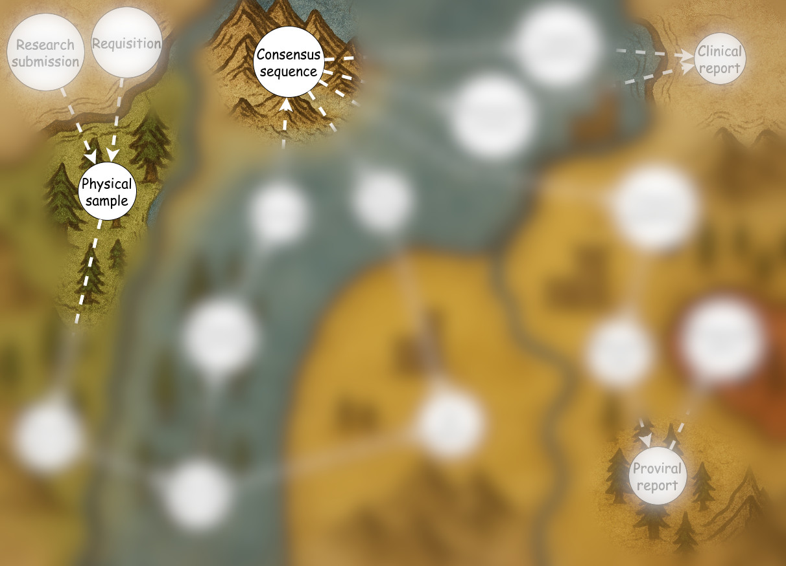
</v-drag>

<!--
The first obvious subgoal on the path from requests to report, is getting a physical sample into our lab. The second subgoal is to turn that sample into a consensus DNA sequence.
-->

---
dragPos:
  main: 120,0,758,568
  text: 169,420,489,44
---

<v-drag pos="main">

</v-drag>

<v-drag pos="text">

Both V3/resistance and research work follow the same backbone

</v-drag>

<!--
Once you accept those two states as the backbone, both the V3/resistance pipeline and the research pipeline look like variations on the same theme. Different requisitions, different reports, but the same two internal states in the middle.
-->

---

## Subgoal 1: get a physical sample

 

- An actual **tube in our lab**, labelled and received under a known requisition.
- Enough **material of the right type** (plasma, whole blood, PBMCs, etc.) to run the planned assays.
- A sample whose **identity and timing** we trust.

It is its own goal

- Without a sample, the rest of the pipeline is purely hypothetical.
- This is where the real world and our digital systems first have to agree on **who**, **what**, and **when**.
- Mistakes here — wrong person, wrong tube, wrong date — are worse than having no sample at all.

<!--
The first subgoal sounds almost too obvious: we need to get a physical sample.

But conceptually this is a big moment in the workflow. Up until now we only had a requisition, which is essentially a promise on paper: someone is asking us to do something for a particular person or project.

This state carries hidden assumptions. The type of sample determines what biology we can and cannot see. Plasma, whole blood, or PBMCs will all give us different windows into the virus and the host.

And identity is crucial. A beautifully sequenced sample from the wrong person is worse than no sequence at all. So at this point in the workflow we care a lot about matching the tube in the rack to the digital record in our systems.
-->

---

## Subgoal 2: produce consensus

 

- We have an complete, digital representation of the virus from that sample.
- An actual string of ACTG letters.

Why a consensus sequence is such a useful state

- A representation that is **easy to store, compare, and interpret**.
- It is the **standard interface** to everything downstream: HIVdb, intactness tools, alignments, and reporting.
- It collapses a very complicated experiment into a simple string of A, C, T, and G that we can reason about.
- It lets us **re-interpret** the same data later as rules, tools, and guidelines change.

<!--
The second subgoal is to produce a consensus DNA sequence.

This consensus becomes the standard interface to the rest of the pipeline. It is what we align to reference, what we feed into HIVdb for resistance interpretation, and what we send into the intactness pipeline for defect classification.

The reason we treat "consensus sequence" as its own goal is that it separates two worlds. Upstream we worry about chemistry, instruments, and file transfers. Downstream we worry about biological interpretation. The consensus sequence is the bridge between the two, and because it is such a powerful bridge we invest a lot of effort in getting it right and in keeping the raw data available behind it.
-->

---

## Counterfactual pondering

<!--
More on this: https://chatgpt.com/share/692f7e0d-e8d8-800e-80bc-30cc076cbec6
-->

What partial goals we could still achive without Subgoal 1 and Subgoal 2?

- IPDA intactness testing
- HLA allele inheritance
- ...

<!--
As a side note I would like to point out that there are exceptions.

For example, we can quantify intactness without ever seeing a DNA sequence. Assays like IPDA use PCR with a couple of probes to count how many proviruses look intact at specific sites, and they never produce an ACTG string.

Then, in the same way how blood type can sometimes be deduced from the parents’ blood types... if neither parent has a problematic HLA allele, then their children can’t inherit it either.
-->

---
dragPos:
  main: 749,244,924,669
  text: 56,133,691,420
---

## From requisition to physical sample

A requisition arrives → lab receives a sample → information must flow to bioinformatics pipeline

<v-drag pos="text">

**Challenges:**

- **Real-world ↔ Digital coordination**: Physical tubes, in various steps along the pipeline, must match digital records in the system
- **Historical traceability**: Every sample, every run, every decision must be reconstructable months or years later
- **Data integrity**: Typos in sample IDs, missing metadata, or mismatched records can derail the entire pipeline

**Solutions:**

- QAI: our in-house Laboratory Information Management System.

</v-drag>

<v-drag pos="main">

</v-drag>

<!--
This is the first critical handoff in our workflow - moving from an abstract request to a concrete physical sample that both the lab and our automated systems can track.

The challenge here is coordination. Someone in the lab is handling a physical tube with a label. Meanwhile, our bioinformatics pipeline needs to know exactly which sample that tube represents, what project it belongs to, and what kind of analysis we promised to deliver.

QAI is our custom-built LIMS - Laboratory Information Management System. Here, it solves three core problems:

First, it provides the coordination layer between the physical lab and our automated informatics systems.

Second, it handles historical preservation. QAI stores everything in an Oracle database. This means years later, if someone asks "what happened with this sample?", we can reconstruct many details.

Third, it provides input validation. Before a sample ever reaches the sequencer, QAI checks that sample IDs are formatted correctly, that the requisition exists, that the sample type matches what was requested. This catches problems early, before they waste expensive sequencing runs.

The concrete artifact that QAI produces is the sample sheet - a CSV file that defines which samples are in a MiSeq run and how they should be processed. Both MiSeq software and MiCall's automated watcher will later read those sample sheets.

The procedure details - how lab staff use QAI's interface, what fields they fill in - those are documented in our SOPs. What matters here is understanding QAI's architectural role: it's the authoritative source of truth that connects requisitions to samples to sequencing runs.
-->

---

## Many ways to do sequencing

Going from sample to DNA sequence is what we call **sequencing**.

### Two mature technologies

**Sanger sequencing** → used with **ReCall**
- Population-level consensus
- Maximum read length ~700bp
- Clean signal for homogeneous samples
- Used for HIV genotyping

**Next-generation sequencing (NGS)** → used with **MiCall**
- Deep sequencing of viral populations
- Thousands of short reads (~250bp each)
- Captures whole genomes and minority variants
- Handles high-variability regions (indels, hypervariable loops)

<!--
The term "sequencing" refers to the entire transformation from a physical blood sample into digital strings of nucleotides. But there are many ways to do that transformation.

For decades, our lab used Sanger sequencing, consumed by ReCall.

Sanger has fundamental limitations. First, the read length: we can only sequence up to about 700 base pairs in one experiment.

Second, Sanger struggles with heterogeneous populations. If you have a mixture of variants, especially with insertions or deletions, the chromatograph signals interfere with each other and become unreadable. This is particularly problematic in highly variable regions like the V3 loop.

MiSeq does Next-generation sequencing.

This technology is quite different. For one, instead of producing one long read, it produces thousands of short reads, each about 300 base pairs long.
-->

---
dragPos:
  main: 734,-111,924,669
  text: 31,86,698,462
---

## Subgoal 3: NGS output

<v-drag pos="main">
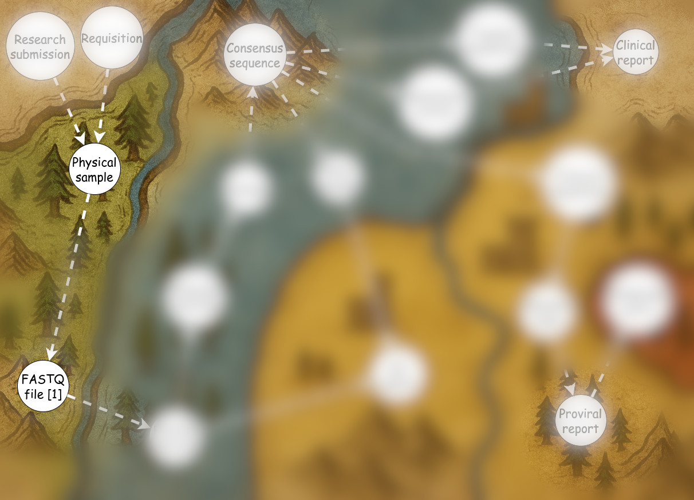
</v-drag>

<v-drag pos="text">

Choosing NGS creates a new intermediate goal: thousands of short reads, also known as **FASTQ file**.

- Raw output from the MiSeq sequencer
- Each read: ~250 nucleotides + quality scores
- Thousands of reads per sample, normally at random positions across the genome

</v-drag>

<!--
Once we commit to next-generation sequencing, we immediately create a new milestone: obtaining the thousands of short reads that the MiSeq produces in the form of FASTQ files.

To be complete, there are other inputs that come along with the FASTQ files - run metadata, sample sheets, and quality metrics. But the FASTQ files are most conceptually significant.
-->

---
dragPos:
  main: 734,-111,924,669
---

## From sample to FASTQ

### The wet lab's job

This happens in the lab with molecular biology and chemistry:

- Extract DNA from the blood sample
- Use PCR to amplify viral regions
- Prepare sequencing libraries
- Run the MiSeq sequencer

<v-drag pos="main">

</v-drag>

<!--
This is where the lab team does their work. I won't dive into the chemistry details since that's not my expertise. But I do want to acknowledge challenges that are solved: 
-->

---
dragPos:
  main: 608,17,313,426,6
---

## Needle in a haystack

In 1mL of blood from someone on ART:

- **5-6 billion** total particles
- **7.5 million** white blood cells
- **~100** infected cells
- Viral genome is **<10 Kbp** hiding in **4 Gbp** of human DNA
- **~1 copy** of HIV RNA

<v-drag pos="main">
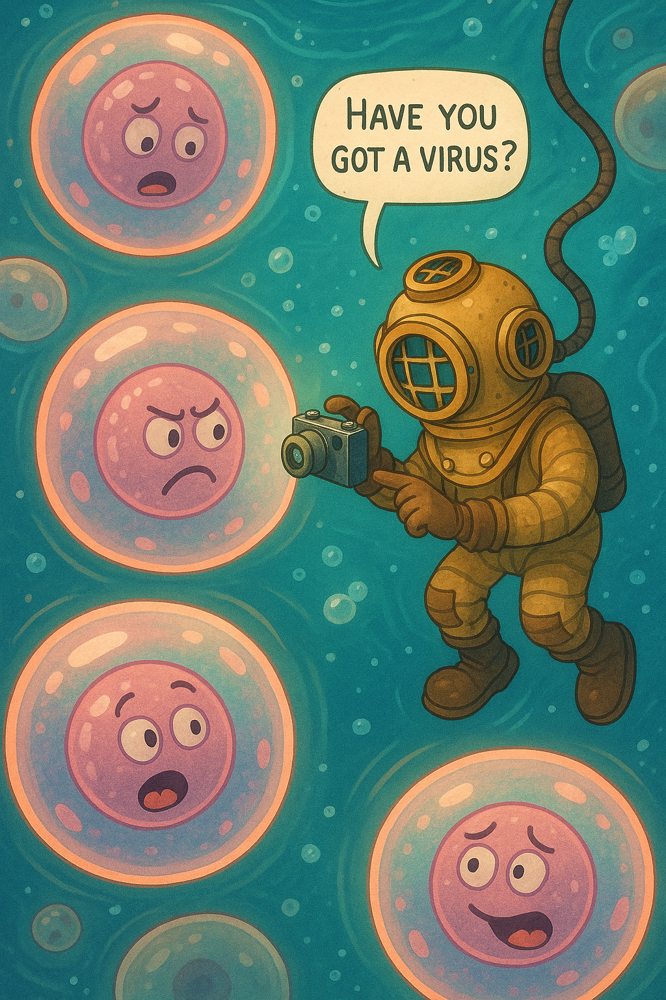
</v-drag>

<!--
Finding tiny amounts of viral DNA is one challenge that is particularly clear to me. 

The numbers show why it so impressive. Infected cells are one in 75,000. The viral genome is thousands of times smaller than the human genome.
-->

---

## Sequencing solutions

<!--
My strategy here is to list Nobel-level discoveries that were necessary to do this work.

First nobels provide the absolute basic: "what and where to look for".

- 1975 Physiology or Medicine – Dulbecco, Temin, Baltimore. Awarded for discoveries on how tumour viruses interact with cellular genetic material, including the discovery of reverse transcriptase and the provirus concept.
- 2008 Physiology or Medicine – Barré-Sinoussi & Montagnier (plus zur Hausen for HPV) “for their discovery of human immunodeficiency virus”  That’s the step where “some immune-destroying thing” becomes this specific retrovirus with this specific genome that you are now sequencing on MiSeq.
- 1993 Chemistry – Mullis & Smith. One half to Kary Mullis “for his invention of the polymerase chain reaction (PCR) method”; the other to Michael Smith for oligo-based site-directed mutagenesis.
- 1980 Chemistry – Berg, Gilbert, Sanger. Half to Walter Gilbert and Frederick Sanger “for their contributions concerning the determination of base sequences in nucleic acids.” MiSeq is based on Sanger.

(More on this: https://chatgpt.com/share/692f7564-8780-800e-88e8-f7d33366fc3c )
-->

"What’s inside this MiSeq run?"

**1975 Medicine** – Dulbecco, Temin, Baltimore
How retroviruses work (reverse transcriptase, proviruses)

**2008 Medicine** – Barré-Sinoussi & Montagnier
Discovering HIV itself

**1980 Chemistry** – Sanger
How to read DNA sequences

**1993 Chemistry** – Mullis
PCR: copying specific DNA millions of times

<!--
Other than just finding the genetic material, there are a series of Nobel-level problems that had to be solved.

Even the basic question of "what are we looking for?" requires a very non-obvious concept of retrovirus, reverse transcription, and the provirus.

On this slide I listed some key discoveries.
We can recognize some of the names here, such as Sanger and Montagnier.
-->

---
dragPos:
  main: 120,0,758,568
---

<!--
## From FASTQ to consensus

Now we have FASTQ files full of thousands of short reads. Next job: turn those into consensus sequences.

**MiCall handles this automatically**
-->

<v-drag pos="main">

</v-drag>

<!--
From here on it's all software. The MiSeq gave us FASTQ files - now MiCall takes over. MiCall is a big pipeline with lots of steps, but the key thing is it runs automatically.
-->

---
dragPos:
  main: 120,0,758,568
  text: 42,-14,965,491
---

<v-drag pos="main">

</v-drag>

<v-drag pos="text">

## Transport

Challenge: actually getting hold of the FASTQ files.
We need automatic, reliable file transfer from MiSeq to somewhere MiCall can see them.

**The solution:**
- MiSeq runs Windows.
- There is a daemon script provided by Illumina.
- We configured it to copy finished runs to our network `RAW_DATA` drive.
- Happens automatically when sequencing finishes.

</v-drag>

<!--
The basic problem is that we cannot just run MiCall on the MiSeq machine.
The MiSeq does have a computer inside. It is actually a Windows computer.
When sequencing finishes, the FASTQ files are sitting on that machine.
We need them on our network where MiCall can process them.
Illumina provides a daemon that can copy to network shares - we pointed it at our RAW_DATA drive.
-->

---

## Discovery

Challenge: how do we know when data is ready?

MiSeq itself doesn't notify us in an automated way.

Solution:
- We have an periodic task that runs in ScriptBunny (every 15mins).
- It monitors `RAW_DATA` drive for new files and folders.
- It looks if those files "look done copying", and then puts a "flag file" called `needsprocessing`.
- We have a periodic tasks in MiCall watcher (every 10mins) and in miseqqc (every 10 mins).
- They look for `needsprocessing` as a signal to start processing.

<!--
The MiSeq doesn't tell us when its done. So we check ourselves. A script checks the RAW_DATA drive every 15 minutes looking for new run folders. When it sees files that look complete, it drops a special flag file called `needsprocessing`. Then MiCall's watcher and MiseqQC pick that up and start processing.
-->

---
dragPos:
  main: 598,-6,772,520
---

## Filtering reads

**Challenge**: raw reads from MiSeq contain
- errors
- auxiliary, intervening artifacts.

**MiCall filtering strategy**
- Rejects reads with too many low-quality bases
- Removes primers
- Strips remaining adapters
- Filters out reads that don't align well to references

**Phred scores** - the sequencer's confidence metric
- Each base gets a quality score: Q = -10 × log₁₀(error probability)
- MiSeq outputs these in FASTQ files alongside each nucleotide
- Named after **P**hil **R**ead **Ed**itor (PHRED)

<v-drag pos="main">
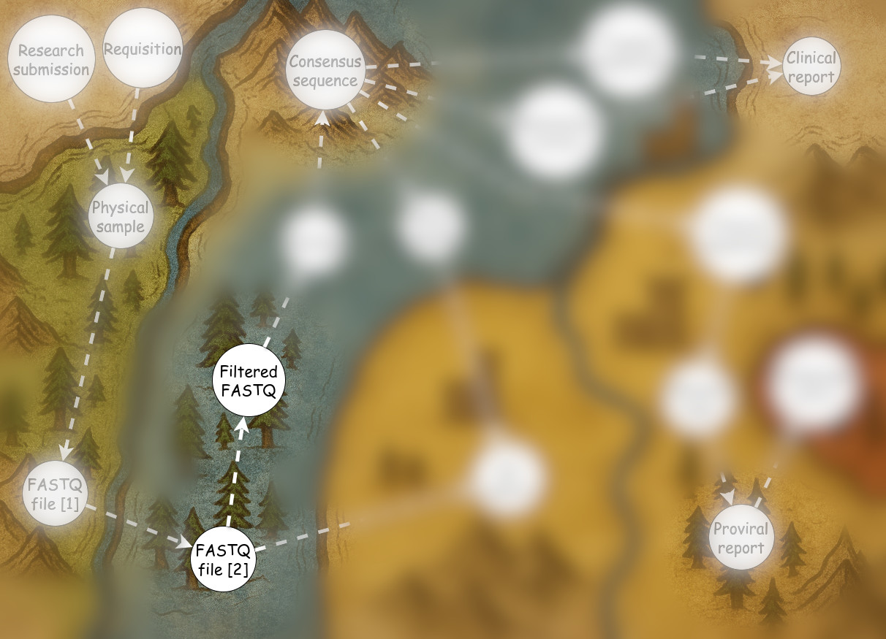
</v-drag>

<!--
Software quality control starts at the sequencer. The MiSeq assigns a Phred score to every base it calls. Each score is a measure of confidence in that base. A Phred score of 30 means the sequencer is 99.9% confident that base is correct. These scores travel with the sequence data in the FASTQ files and guide all downstream filtering.

MiCall uses these quality scores to filter out unreliable reads before assembly.
There are other preprocessing steps, but overall MiCall starts by trying to improve input before building consensus.
-->

---

## Many ways to build consensus

<!--
TODO:
Show a graphic of thousands of reads.
It should show depict that these reads are short and they come from random places in the virus' genome.
-->

**Remapping approach:**
- Map reads to known reference genomes (like HXB2)
- Build consensus from the aligned reads
- Used for V3 work

**De novo assembly:**
- Assemble reads into contigs without a reference
- Then align contigs to references to figure out what they are
- Used for research/proviral work

<!--
Now that we've got cleaned reads, we need to turn them into consensus sequences.

MiCall can do this two ways.

In the remapping mode it is faster and works great when we know what you're looking for.
This mode is used for clinical testing.

De novo mode is more complex, but it can give more high quality results.
Especially for variants that don't map well to references.
-->

---
dragPos:
  main: 352,66,658,470
  text: 25,91,338,325
---

## Denovo assembly

<!--
TODO: estimate run time of naive overlap finding algorithm.
-->

<v-drag pos="text">

**The challenge:**
- Find overlapping reads to build contigs
- This is computationally hard, naive approach would take forever

</v-drag>

<v-drag pos="main">

</v-drag>

<!--
I will focus on De novo because it is more interesting and more complex.

The idea is simple: we want to combine overlapping reads into longer sequences called contigs.
Eventually these contigs will grow to cover the whole sequencing target.

But we're trying to figure out which reads overlap without knowing the answer ahead of time.
A naive approach would compare every read to every other read.
This becomes completely infeasible for large number of reads.
-->

---
dragPos:
  main: 352,66,658,470
  text: 25,91,338,325
---

## Denovo assembly

<!--
TODO: estimate run time of naive overlap finding algorithm.
-->

<v-drag pos="text">

**The solution:**
- Use hashing and k-mers for fast overlap detection
- Assemble reads into contigs
- Stitch contigs together when they overlap

</v-drag>

<v-drag pos="main">

</v-drag>

<!--
The key trick is to build a library of patterns called k-mers.
Then look for reads that share the same patterns. Those will be the ones that overlap.
MiCall assembles contigs this way and then stitches them together.

Unfortunately, the k-mer approach can result in too many independent sequences instead of a single consensus.
Stitching ensures we only get one when it's possible.
-->

---

## Pipeline orchestration

Challenge: preserve all inputs and outputs for historical and development purposes.

Solutions:
- Run all important steps through Kive.
- Poll Kive to see when results are available.
- Download results to `RAW_DATA`.

<!--
All of MiCall's steps are orchestrated through Kive.

Think of Kive as a lab notebook for computational pipelines.
When MiCall analyses something, it sends that work to Kive rather than running it locally.
Kive stores the inputs, outputs, and exact software versions used.

This solves the reproducibility problem.

With Kive we can also easily reprocess runs with different versions and parameters.
It's like having a time machine for our analyses.

The watcher polls Kive periodically to see when jobs complete,
then downloads the results back to RAW_DATA where they can be accessed by downstream tools.
-->

---
dragPos:
  main: 120,0,758,568
---

<!--
TODO:

summarize consensus bulding.

uncover more of the diagram.
-->

<v-drag pos="main">
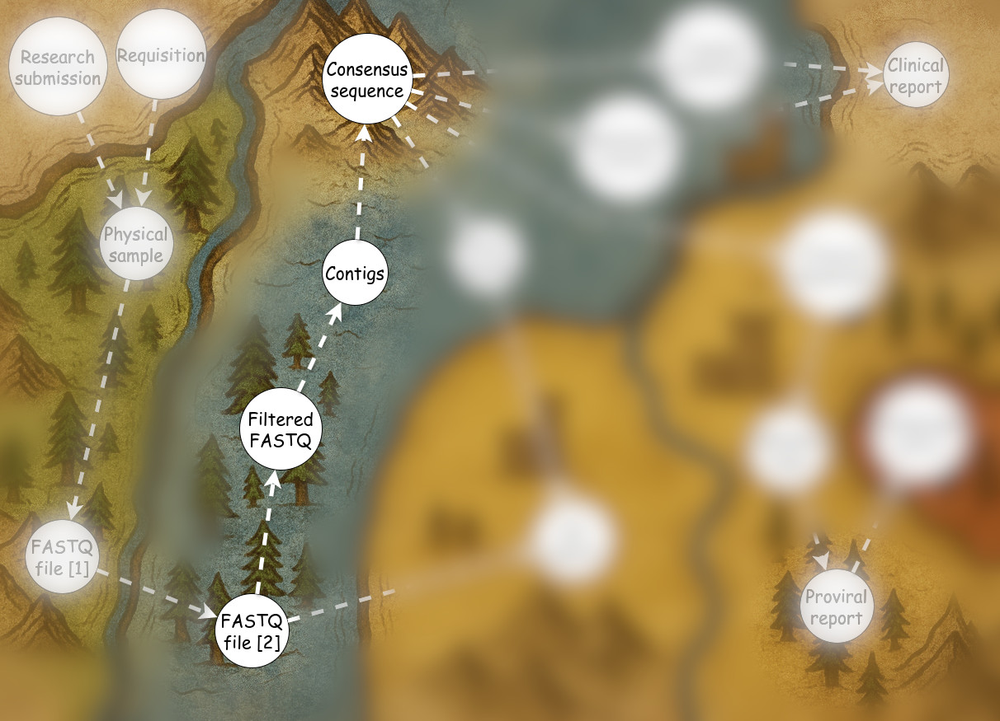
</v-drag>

<!--
At this point we have covered the main steps MiCall takes to turn FASTQ files into consensus sequences.

The details of remapping and de novo assembly are complex,
but the key takeaway is that MiCall builds consensus in three main steps:
- first filtering,
- then assembly,
- then stitching.
-->

---
dragPos:
  main: 120,0,758,568
  text: 194,335,603,326
---

<v-drag pos="main">
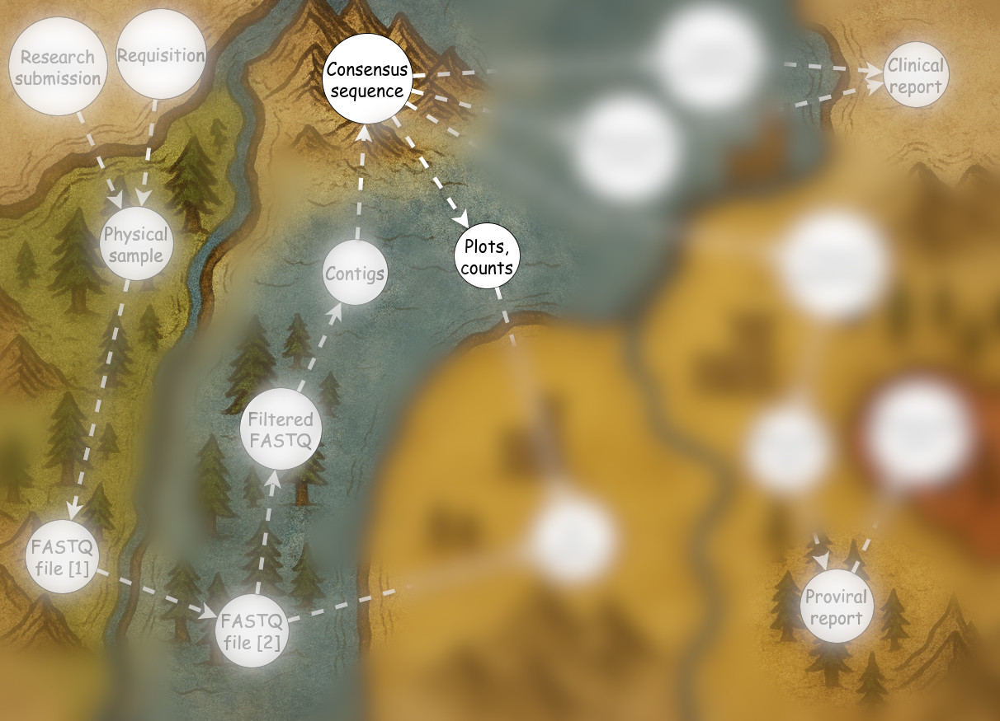
</v-drag>

<v-drag pos="text">

**Besides consensus sequences, MiCall also produces:**
- Coverage metrics and plots (depth at each position)
- Concordance metrics and plots (agreement with reference)
- Stitching logs and plots (how contigs were combined)

</v-drag>

<!--
MiCall produces more than just consensus sequences. It also generates:
- coverage metrics
- concordance metrics
- stitching logs
- as well as other diagnostic plots and tables.
-->

---

## QAI upload

**MiCall sends data into QAI**

**What gets uploaded:**
- Consensus sequences (`conseqs.csv`)
- Coverage metrics (min coverage, min coverage position)
- Read counts (raw reads, mapped reads)
- Quality scores per sample

**QAI displays this through:**
- **Review interface** - users can browse samples by run
- **Per-sample metrics** - mapped reads, coverage depths, acceptance decisions
- **Error metrics tables** - tile-by-cycle quality visualizations

<!--
After MiCall finishes processing a run, the results need to reach the people who will interpret them.
Some of the results, especially proviral, are accessed through RAW_DATA.
But also MiCall uploads consensus sequences, coverage statistics, and quality metrics into QAI's, where they can be found by run ID.
-->

---

## MiseqQC processing

**MiseqQCReport daemon** - automated quality monitoring
- Perl script runs periodically checking for new MiSeq runs
- Parses Illumina's InterOp binary files (optical metrics, phred distributions)
- Uploads QC data to Oracle database tables: `MISEQQC_RUNPARAMETERS`, `MISEQQC_INTEROPSUMMARY`

**MiseqQC report generation**
- Python tool that queries the database
- Generates per-run HTML/PDF reports with:
  - Cluster density, %PF (passing filter), Q30 percentages
  - Levey-Jennings charts tracking metrics over time
  - Westgard rules for detecting systematic problems
- Uploads reports to http://192.168.69.223/MiSeq_QC/

<!--
At the same time as MiCall is processing sequences, we also run quality control on the sequencing runs themselves.
Our script called MiseqQC runs automatically after each sequencing run completes. It parses the raw files that MiSeq produces and uploads data into our Oracle database. This creates a historical record of every run's performance.

The MiseqQC tool then generates reports from that database. It produces both individual run reports and aggregate charts that track metrics like cluster density and Q30 scores across multiple runs. The reports are automatically published to a web server where lab staff can review them before releasing results.
-->

---
dragPos:
  main: 120,0,758,568
---

<!--
TODO:

summarize quality control up to this point.
-->

<v-drag pos="main">
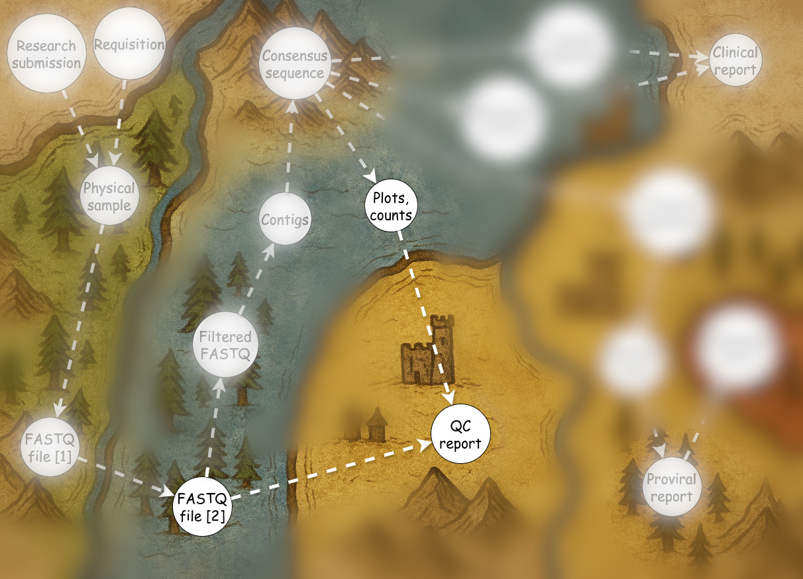
</v-drag>

<!--
In summary, both MiCall and MiseqQC produce several sets of quality control metrics along the way.

They then upload them to QAI, and on the web server, where lab staff can review them before releasing results.
-->

---
dragPos:
  main: 120,0,758,568
---

<v-drag pos="main">
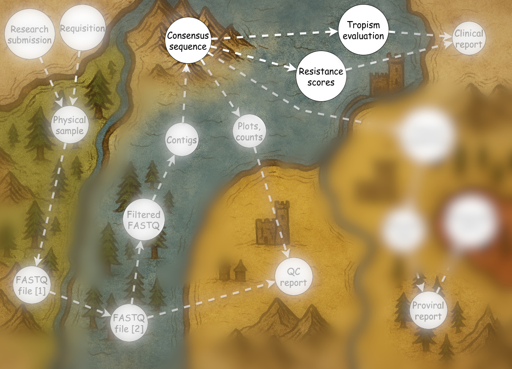
</v-drag>

<!--
Now that we have consensus sequences, we can move on to the final steps: producing reports for V3 tropism testing and resistance testing.
-->

---

## V3 Tropism Testing

**Challenge:** Predict which coreceptor HIV uses to enter cells
- **R5-tropic** (uses CCR5) → maraviroc eligible
- **X4-tropic** (uses CXCR4) → maraviroc won't work

**Solution:**
1. Extract and align V3 loop sequences (~35 amino acids)
2. Score using geno2pheno PSSM algorithm (similar to resistance interpretation)
3. Call: score ≥ 3.5% → R5, score < 3.5% → X4

**Output:** `g2p.csv` + `g2p_summary.csv`

<!--
What is tropism testing?

The V3 loop in HIV's envelope protein determines which coreceptor the virus uses - CCR5 or CXCR4. This matters because maraviroc is a drug that blocks CCR5. If a patient has X4-tropic virus, maraviroc will be completely ineffective.

The geno2pheno algorithm predicts tropism from the V3 amino acid sequence using a position-specific scoring matrix.

Our threshold for calling a sample X4 is conservative - it catches minority variants that could cause treatment failure.
-->

---

## Resistance interpretation

Challenge: given a consensus sequence, predict drug resistance mutations.

Solution:
- Align consensus to reference genome.
- Then use HIVdb to score resistance.

<!--
Resistance interpretation for HCV works similarly to what we do for HIV in the Sanger pipeline. We take the consensus sequence, align it to identify the relevant genes, then use the HIVdb to score mutations against known resistance patterns.
-->

---
dragPos:
  main: 120,0,758,568
---

<v-drag pos="main">

</v-drag>

<!--
Both resistance interpretation and V3 tropism predictions are later picked up by Script Bunny.

Script Bunny generates the final PDF reports that go back to clinicians.
-->

---

## Proviral pipeline

**Challenge**: Determine if integrated HIV DNA can produce infectious virus

- **Quality filtering** - exclude non-HIV sequences, low coverage, ambiguous bases
- **Primer detection and removal** - strip lab-added primers to analyze only viral genome
- **Defect classification** - identify hypermutation, deletions, inversions, frameshifts, stop codons
- **Gene extraction** - splice out individual genes (gag, pol, env, etc.)

**Solution**: Multi-stage pipeline with strict QC

- `cfeproviral` - wrapper that orchestrates filtering, primer handling, gene splicing
- `CFEIntact` - core defect detector (BLAST alignment, ORF detection, APOBEC scan, structural checks)
- `BBLabs/alldata/bblab_site/tools/proviral_landscape_plot/` - web tool for visualizing defect distribution

<!--
On the research side we have several mode analysis steps.
They are mostly contained within the proviral pipeline.

The proviral pipeline answers a key question: which integrated proviruses are replication-competent and which are defective?

Similarly to MiCall, the proviral pipeline starts by filtering out low-quality inputs.

It then extracts individual viral genes like gag, pol, and env a provides their ACTG sequences. 
The landscape CSV maps defect coordinates across the genome, and users manually upload this to the BBLabs web tool to generate visual plots showing defect patterns and distributions across samples.
-->

---

## CFEIntact

Challenge: find open reading frames in HIV proviral sequences.

Solution:
- Align consensus to reference genome.
- Look for start codon (ATG).
- Look for stop codons (TAA, TAG, TGA).
- Find the longest ORF between start and stop codons.

<!--
CFEIntact's first job is identifying where genes are in the proviral sequence. An open reading frame is a stretch of DNA that could code for a protein.

The tool aligns the proviral sequence to a reference genome to figure out where known genes should be, then scans for actual start and stop codons in the sample. The longest ORF for each gene becomes the candidate for further analysis.
-->

---

## CFEIntact [2]

Challenge: determine if an ORF is intact or has defects that prevent viral replication.

Solution:
- Look for premature stop codons.
- Look for frameshifts.
- Look for deletions beyond a certain length.

<!--
CFEIntact then checks whether that ORF could actually produce a functional protein. Premature stop codons truncate proteins early. Frameshifts throw off the reading frame so everything downstream becomes gibberish. Large deletions remove essential protein domains.

Such defects can make the provirus unable to replicate. A single premature stop in gag or pol is enough to render the entire provirus defective. CFEIntact catalogs all these problems and uses them to classify whether the provirus is intact or broken.
-->

---

## CFEIntact [3]

Other challenges beyond ORF analysis:
- Detect hypermutation.
- Determine if packaging signal is intact.
- Determine if major splice donor site is intact.
- Detect out-of-order genes.
- Detect large deletions.

<!--
CFEIntact does more than just check individual genes.
When multiple defects exist, the proviral pipeline picks the most serious one based on a severity ranking to represent that provirus.
-->

---
dragPos:
  hepcresist: 414,21,549,590
---

## Resistance interpretation

<!--
Observe that the result looks like resistance reports from ReCall.
-->

 

- Performed for HCV resistance testing.
- Not clinically approved.
- Similar to our HIV resistance reports from ReCall.
- Uses the same HIVdb library.

<v-drag pos="hepcresist">

</v-drag>

---

## Summary

Key strengths of the MiSeq workflow:

- Software side is maintainable and high quality.
  - Designed with containerization, reproducibility, and maintainability in mind.
- Flexible - one program to rule them all.
  - Shown to handle HIV, V3, HCV, SarsCov2.
  - Used for both research and clinical work.

<!--
The MiSeq workflow is flexible and robust. MiCall handles multiple virus types - HIV, HCV, we even sequences SARS-CoV-2 during the pandemic. It serves both clinical workflows like V3 tropism testing and research workflows like proviral intactness analysis.

From engineering perspective, the system is built for maintainability. MiCall is very pleasant to work with, add new features, and fix bugs. It uses all most up to date software libraries as well as modern practices like containerization.
-->

---
layout: cover
background: https://cover.sli.dev
zoom: 2.0
hideInToc: true
---

# Thank you

<!--
TODO: add a small workflow diagram that shows the whole pipeline.
-->

<!--
I hope this talk helped you understand the MiSeq workflow better, and why we do things the way we do.
Thank you for listening.
-->
